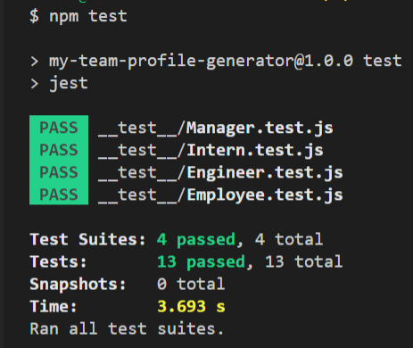
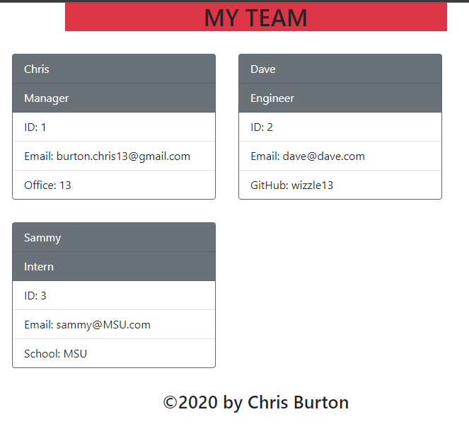

 # Team Profile Generator
    
  ## Description
  Node.js command-line application that takes in information about employees on a software engineering team and generates an HTML webpage that displays summaries for each person.

  ### Tools and Languages used
  
  
  
  

  
  
  ## Table of Contents
  
  
  - [Screenshots](#screenshots)
  
  
  - [Links](#links)
  
  

  

  ## Screenshots
  

  

  

  

  ## Links
  GitHub Repository: https://github.com/wizzle13/my-team-profile-generator

  video: https://drive.google.com/file/d/1sFrV8LU3Nn2L_X4oOfct8VHkPP073mjR/view?usp=sharing

  &copy;2020 by Chris Burton
